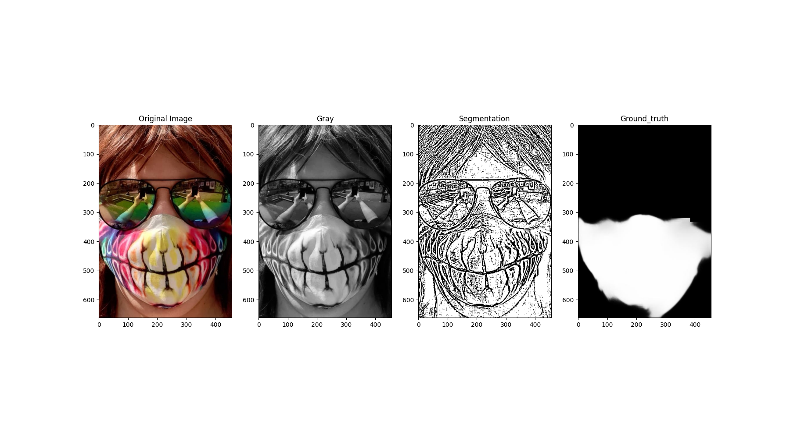
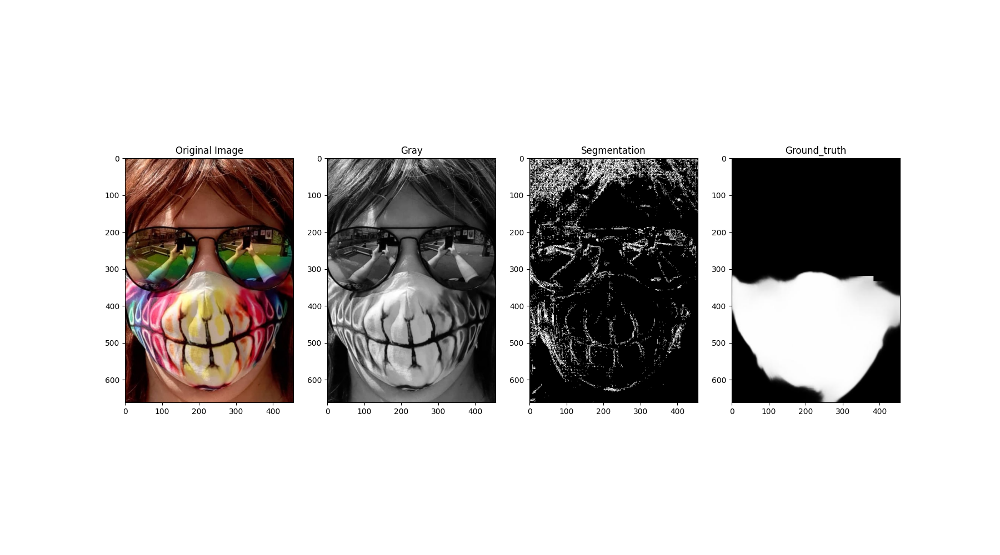
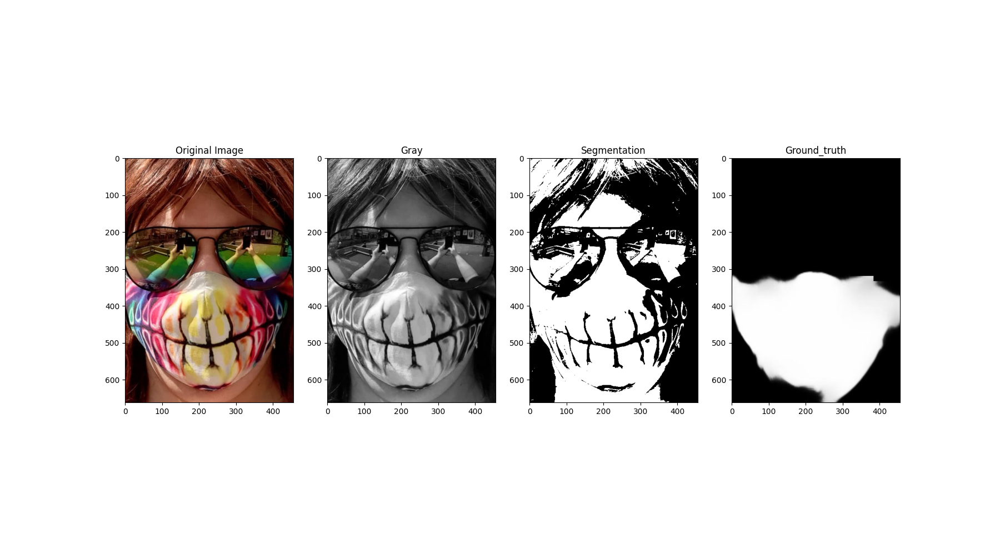
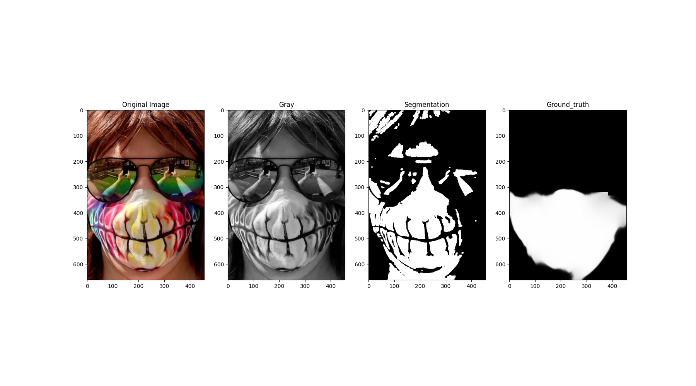
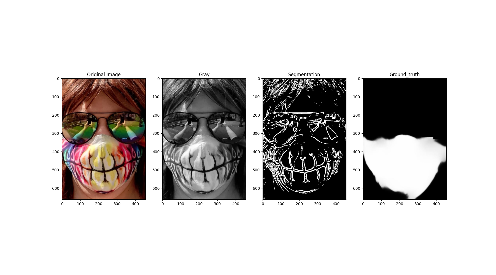
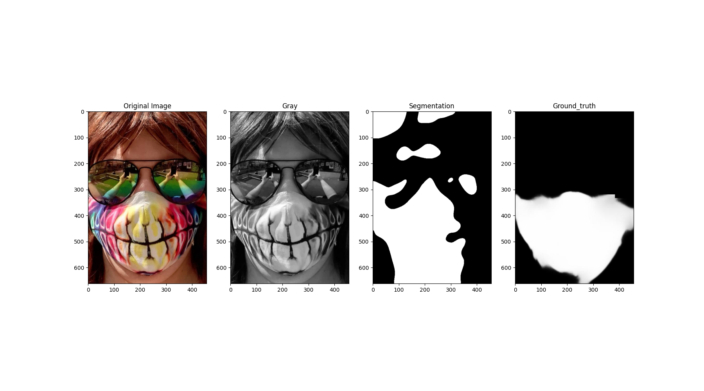

# Face Mask Classification and Segmentation

## Team Members

- Nikita Kiran - IMT2022028
- Sasi Snigdha Yadavalli - IMT2022571
- Akshaya Bysani - IMT2022579

## Introduction

This project aims to develop a comprehensive computer vision solution for classifying and segmenting face masks in images using both traditional machine learning (ML) classifiers and deep learning techniques. The primary objectives include:

- **Binary Classification with ML Classifiers**: Classify faces as "with mask" or "without mask" using handcrafted features and machine learning classifiers like Support Vector Machines (SVM) and Neural Networks.
- **Binary Classification with CNN**: Design and train a Convolutional Neural Network (CNN) for the same classification task, applying different hyperparameter variations to optimize performance.
- **Region-Based Segmentation**: Implement traditional region-based segmentation techniques (e.g., thresholding, edge detection) to segment face masks from images identified as "with mask."
- **Mask Segmentation with U-Net**: Train a U-Net model for accurate mask region segmentation and compare its performance with traditional segmentation methods using metrics like Intersection over Union (IoU) and Dice score.

## Dataset

### **Binary Classification Dataset**
- **Source**: [Face Mask Detection Dataset](https://github.com/chandrikadeb7/Face-Mask-Detection/tree/master/dataset)
- **Structure**: The dataset contains two folders:
  - `with_mask`: Contains images of individuals wearing face masks.
  - `without_mask`: Contains images of individuals without face masks.
- **Total Images**: 4,095 images
  - `with_mask`: 2,165 images
  - `without_mask`: 1,930 images

### **Segmentation Dataset**
- **Source**: [MFSD Dataset](https://github.com/sadjadrz/MFSD)
- **Structure**:
  - `1` and `2`: Each contains an `img` folder with images of people with and without face masks.
  - `face_crop`: Cropped face images from the `img` folders.
  - `face_crop_segmentation`: Ground truth images representing mask segmentation.
  - `dataset.csv`: Metadata for the dataset.

```
MSFD
├── 1
│   ├── dataset.csv
│   ├── face_crop
│   ├── face_crop_segmentation
│   └── img
└── 2
    └── img
```

## **Task A**

### **Methodology**

#### **Dataset Loading and Preprocessing**
- The dataset consists of images of faces categorized as "with mask" and "without mask."
- Images are loaded using `cv2.imread()` from two directories (`./dataset/with_mask` and `./dataset/without_mask`).
- Each image is resized to a fixed resolution of **128x128** pixels using `cv2.resize()` to ensure uniformity in size across the dataset.
- Labels are assigned: **1 for "with mask"** and **0 for "without mask."**

#### **Visualization**
- The first 5 images from both categories are displayed using `matplotlib.pyplot` to visually inspect and confirm the dataset's correctness.
- This provides an understanding of image variations and overall data quality.

#### **Feature Extraction**
- Five different handcrafted feature extraction techniques are applied to represent image characteristics effectively:

1. **Histogram of Oriented Gradients (HOG)**:
    - Extracts edge and texture information using gradient orientations.
    - Parameters used: `pixels_per_cell=(4,4)` and `cells_per_block=(3,3)` for fine-grained details.

2. **Local Binary Pattern (LBP)**:
    - Captures local texture patterns using the relationship between neighboring pixels.
    - Parameters used: `radius=2` and `n_points=16`.

3. **Canny Edge Detection**:
    - Identifies object boundaries using the Canny edge detection algorithm.
    - Parameters: `threshold1=50` and `threshold2=150`.

4. **Scale-Invariant Feature Transform (SIFT)**:
    - Detects and describes key points using feature descriptors.
    - The top **50 keypoints** are retained, and descriptors are flattened for feature representation.

5. **Color Histogram**:
    - Extracts color distribution information from the HSV (Hue, Saturation, Value) color space.
    - 3D histogram with **32 bins per channel** is calculated using `cv2.calcHist()`.

- All the extracted features are concatenated using `np.hstack()` to form a single feature vector representing each image.

#### **Data Preparation**
- The complete feature matrix (`X_features`) and labels (`y_labels`) are generated.
- The dataset is split into **80% training** and **20% testing** using `train_test_split()`.
- Features are scaled using `StandardScaler()` to normalize data for better classifier performance.

#### **Model Training and Evaluation**
- Two machine learning classifiers are trained using the extracted features:

1. **Support Vector Machine (SVM)**:
    - A linear SVM (`SVC(kernel="linear")`) is used for binary classification.
    - It tries to find the optimal hyperplane for separation.

2. **Multilayer Perceptron (MLP)**:
    - A neural network with two hidden layers (**128 and 64 neurons**) is used.
    - ReLU activation and a maximum of **1000 iterations** are configured for training.

#### **Evaluation Metrics**
- Both models are evaluated using:
  - **Accuracy Score**: Measures the ratio of correct predictions.
  - **Classification Report**: Provides metrics like precision, recall, and F1-score for both classes.
  - **Confusion Matrix**: Visualized using `seaborn.heatmap()` to observe misclassifications.

### **Results and Observations**

- **SVM Performance**: The SVM classifier achieved an accuracy of **93.04%**. Precision and recall scores for both classes were balanced, indicating reliable classification performance. The classifier performed well for both mask and no-mask cases.
  
- **MLP Performance**: The MLP classifier outperformed SVM slightly with an accuracy of **93.77%**. Notably, MLP showed superior performance in classifying faces **without masks**, achieving a higher F1-score and recall compared to SVM.

- **Class-Specific Observations**:
  - For the "with mask" class, both SVM and MLP showed similar prediction accuracy with a high recall and precision.
  - For the "without mask" class, MLP demonstrated better detection, reducing false negatives and achieving a recall of **0.94** compared to SVM's **0.92**.

- **Conclusion**: MLP's additional computational capacity enabled it to extract deeper patterns within the feature space, leading to superior classification performance for difficult cases.

These findings suggest that MLP may be a better choice when the primary goal is to minimize false negatives in mask detection scenarios.

## **Task B**

### **Methodology**

#### **1. Data Collection and Preprocessing**
- **Dataset**: The dataset consists of images categorized into two classes: `with_mask` and `without_mask`.
- **Image Preprocessing**:
  - All images were resized to **128x128** pixels for uniformity.
  - Images were normalized by dividing pixel values by **255.0** to scale them between **0 and 1**.
- **Labeling**:
  - `1` for **with mask**
  - `0` for **without mask**

#### **2. Data Splitting**
- The dataset was split into:
  - **70%** for Training
  - **15%** for Validation
  - **15%** for Testing
- `train_test_split()` was used with `random_state=42` for reproducibility.

#### **3. Model Design and Hyperparameters**
- A Convolutional Neural Network (CNN) was designed with the following layers:
  - **Conv2D (32 filters)** with **ReLU** activation
  - **MaxPooling2D (2x2)**
  - **Conv2D (64 filters)** with **ReLU** activation
  - **MaxPooling2D (2x2)**
  - **Conv2D (128 filters)** with **ReLU** activation
  - **MaxPooling2D (2x2)**
  - **Flatten** layer
  - **Dense (64 neurons)** with **ReLU**
  - **Dropout (50%)** for regularization
  - **Dense (1 neuron)** with **Sigmoid/Tanh** activation for binary classification

- **Optimizers**: Adam and SGD were used with varying learning rates and batch sizes.
- **Loss Function**: Binary Crossentropy.
- **Evaluation Metrics**: Accuracy and Validation Accuracy.

#### **4. Hyperparameter Variations**
Four sets of hyperparameters were experimented with:

| Model | Activation | Optimizer | Learning Rate | Batch Size |
|---------|-------------|-----------|----------------|-----------|
| 1      | Sigmoid    | Adam      | 0.001         | 32         |
| 2      | Sigmoid    | Adam      | 0.0005        | 64         |
| 3      | Sigmoid    | SGD       | 0.001         | 32         |
| 4      | Tanh       | Adam      | 0.001         | 32         |

#### **5. Training and Evaluation**
- Each model was trained for **10 epochs** using the selected hyperparameters.
- The training used `tf.data.Dataset` for efficient data loading and batch processing.
- Accuracy and Loss metrics were plotted for both training and validation.
- The model with the highest validation accuracy was selected for further testing.
- Final evaluation was conducted using the test dataset, and predictions were compared with ground truth using a **classification report** and a **confusion matrix**.

### **Observations and Results**

1. **Training Performance:**
   - Model 1 with sigmoid activation, Adam optimizer, and a learning rate of 0.001 achieved the highest accuracy with rapid convergence.
   - The validation accuracy consistently improved across epochs, reaching 95.28% by the end of training.
   - Model 2 with a lower learning rate (0.0005) also showed good performance, though slightly lower than Model 1.

2. **Effect of Optimizer Choice:**
   - Models trained using the Adam optimizer generally outperformed the SGD-based model (Model 3).
   - The slower convergence and lower accuracy observed with the SGD optimizer suggest that Adam's adaptive learning rates were beneficial for this task.

3. **Activation Function Impact:**
   - The models using the sigmoid activation function showed more stable learning and higher accuracy compared to the model using tanh (Model 4).
   - Model 4 exhibited performance instability, particularly with a significant spike in validation loss at epoch 4, indicating potential issues with saturation and gradient vanishing.

4. **Validation and Test Performance:**
   - The best model (Model 1) achieved a validation accuracy of 95.28% and a test accuracy of 96%.
   - Precision, recall, and F1-scores were balanced across both classes (with_mask and without_mask), suggesting no significant class imbalance or overfitting.

- **Best Model Configuration:**
  - Activation Function: Sigmoid
  - Optimizer: Adam
  - Learning Rate: 0.001
  - Batch Size: 32

- **Test Set Performance:**
  - Accuracy: **96%**
  - Precision: **0.95 (without_mask), 0.96 (with_mask)**
  - Recall: **0.96 (without_mask), 0.96 (with_mask)**
  - F1-Score: **0.95 (without_mask), 0.96 (with_mask)**

- **Conclusion:**
  - The best-performing model demonstrated high classification accuracy with excellent precision and recall for both classes.
  - The consistent performance across training, validation, and test sets confirms the model's generalizability and robustness.
  - Further improvements could involve experimenting with additional regularization techniques or fine-tuning hyperparameters further.

## **Comparison of Task A and Task B Results and Observations**

#### **1. Accuracy**  
- **Task A (SVM)**: 93.04%  
- **Task A (MLP)**: 93.77%  
- **Task B (CNN)**: 96%  
- **Observation**: CNN outperformed both SVM and MLP, leveraging its ability to extract complex spatial features.

#### **2. Performance on Mask Detection**  
- **Task A (MLP)**: Better recall for "without mask" class.  
- **Task B (CNN)**: Balanced precision and recall for both classes.  
- **Observation**: CNN provided more reliable predictions across both categories.

#### **3. Feature Extraction**  
- **Task A**: Handcrafted features (HOG, LBP, SIFT).  
- **Task B**: Automatic feature extraction using CNN layers.  
- **Observation**: CNN’s automated feature extraction led to improved classification accuracy.

#### **4. Training Time**  
- **Task A**: Faster with SVM and MLP.  
- **Task B**: Longer training time due to CNN’s complexity.  
- **Observation**: CNN demands more resources but results in better performance.

#### **5. Generalizability**  
- **Task A**: Moderate generalizability with handcrafted features.  
- **Task B**: High generalizability, with stable performance across training, validation, and test sets.  
- **Observation**: CNN is preferable for large-scale applications.

#### **Conclusion**  
- **For Simplicity and Speed**: SVM or MLP is recommended.  
- **For High Accuracy and Robustness**: CNN is the better choice.

## Task C

### Methodology for Image Segmentation

#### **Preprocessing**
- **Grayscale Conversion:** All images are converted to grayscale using `cv2.cvtColor()` to reduce complexity.
- **Gaussian Blur:** Applied for noise reduction before edge detection, using a kernel size of **101x101**.

#### **Segmentation Techniques**

##### **A. Otsu's Thresholding**
- Automatically determines the optimal threshold using the Otsu method.
- Applied using `cv2.threshold()` with `cv2.THRESH_BINARY + cv2.THRESH_OTSU`.
- Efficient for images with clear foreground-background contrast.

##### **B. Adaptive Thresholding**
- Divides the image into regions and applies different thresholds using `cv2.adaptiveThreshold()`.
- Parameters:
  - Block Size: **11** (Defines neighborhood size)
  - Constant (C): **2** (Subtracted from mean)
- Suitable for uneven lighting conditions.

##### **C. Canny Edge Detection**
- Detects edges using gradient intensities.
- Parameters:
  - Lower Threshold: **50**
  - Upper Threshold: **150**
- Applied using `cv2.Canny()`.

##### **D. Sobel Edge Detection**
- Uses Sobel operator to detect horizontal and vertical edges.
- Kernel Size: **7x7** (Larger values result in smoother edges)
- Magnitude of gradients is normalized for final edge representation.

##### **E. Laplacian Edge Detection**
- Uses Laplacian operator for second-order derivative edge detection.
- Applied with `cv2.Laplacian()`.
- Noise suppression is managed using adaptive thresholding.

##### **F. Watershed Segmentation**
- Treats image as a topographic surface for segmentation.
- Distance Transform is applied using `nd.distance_transform_edt()`.
- Markers are generated using `morphology.local_maxima()`.
- Applied using `watershed()` from `skimage.segmentation`.

##### **G. Morphological Segmentation**
- Morphological operations clean binary images using `cv2.morphologyEx()`.
- Kernel Size: **3x3** (Structuring element for opening operation)
- Removes small noise and fills gaps.

##### **H. Connected Component Segmentation**
- Labels connected regions using `measure.label()`.
- Small objects are removed using `morphology.remove_small_objects()`.
- Minimum Object Size: **200 pixels**

##### **I. K-Means Segmentation**
- Clusters pixel intensities into `k` clusters using `cv2.kmeans()`.
- Parameters:
  - k: **2** (Foreground and background)
  - Criteria: Convergence at epsilon **0.2** or **100** iterations
  - Attempts: **10**

##### **J. Local Thresholding (Sauvola)**
- Computes threshold locally using `threshold_sauvola()`.
- Window Size: **1001** (Defines region size)
- Effective for text and low-contrast images.

#### **Visualization and Performance Evaluation**
- Visualized using `matplotlib` with grayscale and segmentation outputs.
- Performance metrics include:
  - **IoU (Intersection over Union)**
  - **F1 Score**
  - **Accuracy**
  - **Dice Coefficient**
  - **Jaccard Score**
- Metrics are calculated using `sklearn.metrics` and printed for comparison.

### Observations and Results

```
005320_1.jpg otsu: IoU=0.4854, F1=0.6535, Accuracy=0.7153, Dice=0.6535, Jaccard=0.4854
005320_1.jpg adaptive: IoU=0.3427, F1=0.5105, Accuracy=0.4764, Dice=0.5105, Jaccard=0.3427
005320_1.jpg canny: IoU=0.0937, F1=0.1714, Accuracy=0.5426, Dice=0.1714, Jaccard=0.0937
005320_1.jpg sobel: IoU=0.1722, F1=0.2939, Accuracy=0.5919, Dice=0.2939, Jaccard=0.1722
005320_1.jpg laplacian: IoU=0.0623, F1=0.1173, Accuracy=0.5352, Dice=0.1173, Jaccard=0.0623
005320_1.jpg watershed: IoU=0.5502, F1=0.7099, Accuracy=0.7562, Dice=0.7099, Jaccard=0.5502
005320_1.jpg morphology: IoU=0.4933, F1=0.6607, Accuracy=0.7327, Dice=0.6607, Jaccard=0.4933
005320_1.jpg connected: IoU=0.4895, F1=0.6572, Accuracy=0.7230, Dice=0.6572, Jaccard=0.4895
005320_1.jpg kmeans: IoU=0.4998, F1=0.6665, Accuracy=0.7226, Dice=0.6665, Jaccard=0.4998
005320_1.jpg local: IoU=0.4528, F1=0.6234, Accuracy=0.6499, Dice=0.6234, Jaccard=0.4528
```

#### Otsu's Thresholding


#### Adaptive Thresholding


#### Canny Edge Detection


#### Connected Component Segmentation


#### K-Means Segmentation


#### Laplacian Edge Detection


#### Local Thresholding


#### Morphological Segmentation


#### Sobel Edge Detection


#### Watershed Segmentation



```
Average Metrics for each Method:
otsu: IoU=0.3177, F1=0.4457, Accuracy=0.5235, Dice=0.4457, Jaccard=0.3177
adaptive: IoU=0.3084, F1=0.4672, Accuracy=0.4453, Dice=0.4672, Jaccard=0.3084
canny: IoU=0.1080, F1=0.1884, Accuracy=0.6021, Dice=0.1884, Jaccard=0.1080
sobel: IoU=0.1362, F1=0.2303, Accuracy=0.6135, Dice=0.2303, Jaccard=0.1362
laplacian: IoU=0.1152, F1=0.1987, Accuracy=0.6188, Dice=0.1987, Jaccard=0.1152
watershed: IoU=0.3267, F1=0.4459, Accuracy=0.5296, Dice=0.4459, Jaccard=0.3267
morphology: IoU=0.3036, F1=0.4242, Accuracy=0.5299, Dice=0.4242, Jaccard=0.3036
connected: IoU=0.3104, F1=0.4330, Accuracy=0.5273, Dice=0.4330, Jaccard=0.3104
kmeans: IoU=0.3259, F1=0.4522, Accuracy=0.5325, Dice=0.4522, Jaccard=0.3259
local: IoU=0.3299, F1=0.4661, Accuracy=0.5087, Dice=0.4661, Jaccard=0.3299

Maximum IoU for each Method:
otsu: Max IoU=0.8464
adaptive: Max IoU=0.5466
canny: Max IoU=0.2842
sobel: Max IoU=0.4511
laplacian: Max IoU=0.3639
watershed: Max IoU=0.8725
morphology: Max IoU=0.8496
connected: Max IoU=0.8494
kmeans: Max IoU=0.8565
local: Max IoU=0.8381
```

1. **Performance Overview:**
    - The **local thresholding** method achieved the highest average IoU (0.3299) and F1 score (0.4661), suggesting robust segmentation.
    - **Watershed** and **K-Means** also delivered competitive results, with an average IoU of 0.3267 and 0.3259, respectively.

2. **Edge Detection Methods:**
    - Methods like **Canny**, **Sobel**, and **Laplacian** had the lowest IoU and F1 scores, indicating poor segmentation performance for this dataset.

3. **Morphological Methods:**
    - **Morphology-based** and **Connected Component** segmentation showed moderate success, achieving IoUs of 0.3036 and 0.3104, respectively.

4. **Maximum IoU:**
    - The highest IoU was observed using **Watershed** (0.8725) and **K-Means** (0.8565) in specific scenarios, highlighting their potential for well-defined regions.

- **Best Overall Performance:** The **Local Thresholding** method demonstrated the most consistent results across metrics with the highest average IoU.
- **High Potential Methods:** **Watershed** and **K-Means** are particularly effective when applied to images with clear region separation.
- **Edge Detection Limitation:** Direct edge detection techniques like **Canny** and **Sobel** struggled in this segmentation task, emphasizing the need for region-based methods in complex image scenarios.

## **Task D**

### **Methodology**
 The U-Net architecture is designed for pixel-wise classification and is widely used in biomedical and general image segmentation tasks. The implementation includes data preprocessing, model architecture, training, evaluation, and prediction steps.

#### **Data collection and preprocessing** 
- *Dateset*: The  Masked Face Segmentation Dataset (MFSD) with ground truth face masks has been used here.
  - The folders face_crop and face_crop_segmentation have been used here. The folder face_crop has the images of people wearing 
masks and the folder face_crop_segmentation has the segmented mask outputs.

#### **Data generator**
A custom data generator class (DataGenerator) was implemented using Keras' Sequence API to efficiently load images and corresponding masks in batches, reducing memory consumption.
** Preprocessing steps:**
- Read images and masks from specified directories.

- Resize images and masks to a fixed shape (128, 128) .

- Normalize pixel values by scaling them to [0,1].

- Expand dimensions for grayscale masks to maintain compatibility with the CNN.

#### **Model architecture**
The model follows a U-Net architecture, consisting of an encoder, bottleneck, and decoder, with modifications such as LeakyReLU activation, batch normalization, and dropout to enhance performance.
- **Encoder (Feature Extraction)**
  Each encoder block consists of:
  - Two convolutional layers (3×3 kernel) to extract hierarchical features.
  - LeakyReLU activation to prevent vanishing gradients.
  - Batch Normalization for stable training.
  - MaxPooling (2×2) to downsample feature maps.
  - Dropout (0.3) to prevent overfitting.

- **Bottleneck (Deepest Layer)**
At the bottom of the U-Net, we introduce a bottleneck layer
Two convolutional layers with larger (5×5) filters to capture deeper features.

- **Decoder (Upsampling & Skip Connections)**
  The decoder gradually reconstructs the image, using: 
  - UpSampling2D (instead of transposed convolution) to restore resolution.
  - Concatenation with skip connections to combine high-resolution details from the encoder.
  - Final output layer (1×1 Conv with Sigmoid activation) for binary segmentation.

#### **Model Compilation and Training**
The model is compiled using:

- Adam Optimizer: Adaptive learning for better convergence.
- Binary Crossentropy Loss: Since it's a binary segmentation task (foreground vs. background).
- Accuracy Metric: Measures pixel-wise classification accuracy.

The model is trained using:
Uses the data generator for efficient training.
- Runs for 7 epochs (can be increased for better performance).
- Learning rate = 0.0001
- Training samples per batch = 16.
- Loss function - Binary cross entropy.
- IoU threshold = 0.5


#### **Final output**

- U-Net Mean IoU: 0.9206
- U-Net Mean Dice Score: 0.9547
- output of a prediction of an example image.


## **Comparision between Traditional methods and U-net**
- U-Net achieves state-of-the-art performance in image segmentation, with a Mean IoU of 0.9206 and Dice Score of 0.9547, far surpassing traditional methods.
- Traditional segmentation methods struggle with complex backgrounds, while U-Net can learn context and structure from training data.
- Local Thresholding (Sauvola) achieved the best results among traditional methods, with an IoU of 0.3299, but is still far behind U-Net.
- Traditional segmentation techniques (e.g., Otsu's Thresholding, Watershed, K-Means) are useful for simple images but struggle in complex backgrounds.
- Edge detection techniques like Canny and Sobel perform poorly, as they do not segment objects but only detect boundaries.
  
 | **Aspect** | **U-Net (Deep Learning)** | **Traditional Segmentation Methods** |
|------------|----------------------|---------------------------------|
| **Feature Extraction** | Learns hierarchical **spatial and texture features** | Uses **pixel intensity variations only** |
| **Adaptability** | Generalizes well to **new images** | Works only for **specific contrast levels** |
| **Complex Backgrounds** | Can **differentiate foreground and background** effectively | Fails when contrast is low |
| **Edge Preservation** | Uses **skip connections** to retain details | Edge detection loses important structures |
| **Noise Handling** | Robust to **noise and lighting variations** | **Sensitive to noise**, requiring preprocessing |
| **Performance on Small Objects** | Detects **fine details accurately** | Often **fails for small or unclear objects** |

## Dependencies and Run Instructions

### Requirements
- Python 3.8+
- TensorFlow, NumPy, OpenCV, Matplotlib, Scikit-Learn, Scikit-Image, PyTorch

### Installation
```bash
pip install numpy opencv-python matplotlib scikit-learn scikit-image tensorflow pytorch
```

### Run Instructions

For Task A, B, D download the jupyter notebooks, upload and run each cell. For Task C, run the following command: 

```
python3 ./Segmentation/Task_C.py
```

Make sure the directory structure is similar to the dataset structure. 
